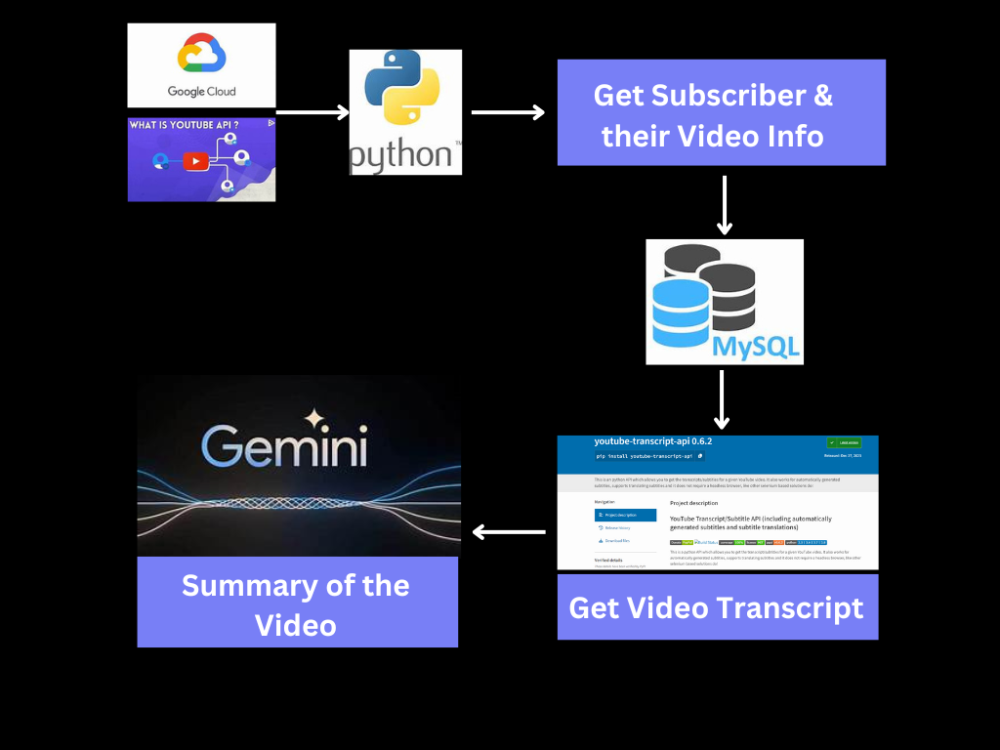

# Youtube_subscriber_service

This is our free open source youtube service project on github

## Local Setup

- Step 1: Check Python version
    ```python3.12 --version```

- Step 2: Create a virtual environment
    ```python3.12 -m venv youtube_subscription```

- Step 3: Activate the virtual environment
    - Linux/Mac: ```source youtube_subscription/bin/activate```

    - Windows (cmd): ```youtube_subscription\Scripts\activate```

## High Level Design/Architecture

