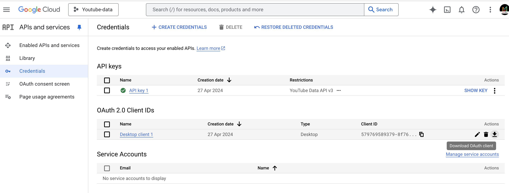

# GCP Project and YouTube API Credentials Setup

## Prerequisites
- A Google Cloud Platform (GCP) account
- Access to the Google Cloud Console
- A YouTube account

## Steps to Create a New GCP Project

1. **Go to the Google Cloud Console:**
    - Navigate to [Google Cloud Console](https://console.cloud.google.com/).

2. **Create a New Project:**
    - Click on the project drop-down at the top of the page.
    - Select "New Project".
    - Enter the project name and select the billing account.
    - Click "Create".

3. **Enable YouTube Data API:**
    - In the Google Cloud Console, go to the "APIs & Services" > "Library".
    - Search for "YouTube Data API v3".
    - Click on "YouTube Data API v3" and then click "Enable".

## Steps to Get YouTube API Credentials

1. **Create Credentials:**
    - Go to "APIs & Services" > "Credentials".
    - Click on "Create Credentials" and select "API key".
    - Copy the API key displayed. This will be used to authenticate your requests to the YouTube Data API.
    - To download the Oauth client secret key you can refer this snapshot:
    - 

2. **OAuth 2.0 Client IDs (Optional):**
    - If your application requires user authorization, you will need OAuth 2.0 credentials.
    - Click on "Create Credentials" and select "OAuth 2.0 Client ID".
    - Configure the consent screen by providing the necessary information.
    - Select the application type (e.g., Web application) and configure the redirect URIs.
    - Click "Create" and note down the Client ID and Client Secret.

## Summary
You have now created a new GCP project, enabled the YouTube Data API, and obtained the necessary credentials to interact with the YouTube API. Use the API key or OAuth 2.0 credentials in your application to access YouTube data.

For more detailed information, refer to the [YouTube Data API documentation](https://developers.google.com/youtube/v3).
